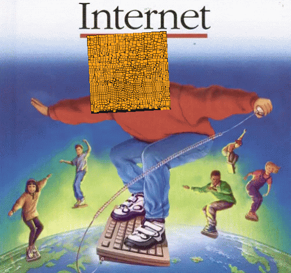

  <div align="center" >
  
  
</div>
<div style="width: 100%;">
  
</div>
<div align="center">

</div>
<div align="center">

</div>
<div align="center">
to my personal GitHub profile!
</div>
<div align="center">

</div>
</div>

<p align="center">

<div width="50px" align="center">

</div>

## About Section


<div align="center"><br></div><br>

🚀 Aspiring DevOps Engineer | Passionate Learner | Fresher Seeking Exciting Opportunities 🚀

 &nbsp;Greetings! I am [Yash Kumar](https://www.linkedin.com/in/yasholo), aka Yasholo :) I am a dynamic DevOps Engineer from [🇮🇳 ](https://en.wikipedia.org/wiki/India)  <br>&nbsp;&nbsp;&nbsp;&nbsp;&nbsp;&nbsp;&nbsp;&nbsp;with a fresh perspective and a thirst for innovation. &nbsp;
<br> 
&nbsp;&nbsp;&nbsp;With a Bachelor of Technology in Computer Science Engineering and a strong foundation <br>&nbsp;&nbsp;&nbsp;&nbsp;&nbsp;&nbsp;&nbsp;&nbsp;in DevOps methodologies and technologies, including AWS Cloud, Python, Linux <br>&nbsp;&nbsp;&nbsp;&nbsp;&nbsp;&nbsp;&nbsp;&nbsp;Administration, Git, Jenkins, Docker, Kubernetes, Terraform, and Ansible. Confidence, <br>&nbsp;&nbsp;&nbsp;&nbsp;&nbsp;&nbsp;&nbsp;&nbsp;determination, and a relentless pursuit of excellence are values that define my approach <br>&nbsp;&nbsp;&nbsp;&nbsp;&nbsp;&nbsp;&nbsp;&nbsp;to life and work. I firmly believe in pushing boundaries, embracing challenges, and <br>&nbsp;&nbsp;&nbsp;&nbsp;&nbsp;&nbsp;&nbsp;&nbsp;continuously learning and growing, I am eager to embark on a rewarding career journey. 🎯 <br>
&nbsp;&nbsp;I have experience with several programming languages, including <br>&nbsp;&nbsp;&nbsp;&nbsp;&nbsp;&nbsp;&nbsp;&nbsp;**Bash, Python, C, CPP, JavaScript, HTML5, CSS3**.<br> 
&nbsp;&nbsp;I’m particularly interested in DevOps, and I’m currently learning: <br>&nbsp;&nbsp;&nbsp;&nbsp;&nbsp;&nbsp;&nbsp;&nbsp;**Big Data | Automation | Advanced SQL | Advanced Java / Python | AWS Cloud** <br>&nbsp;&nbsp;&nbsp;&nbsp;&nbsp;&nbsp;&nbsp;&nbsp;and working on a project that involves fundamental **DevOps**.<br>
&nbsp;&nbsp;Ask me about: **Tech | Linux | Fitness | Literature | Cars ** <br>
&nbsp;&nbsp;Hobbies: **GYM, RUNNING, BADMINTON, READING, WRITING, CHESS, MUSIC,<br>&nbsp;&nbsp;&nbsp;&nbsp;&nbsp;&nbsp;&nbsp;&nbsp;Many more...**<br>
&nbsp;&nbsp;If you want to reach out to me about anything, be it some doubt or just to hangout and talk just<br>&nbsp;&nbsp;&nbsp;&nbsp;&nbsp;&nbsp;&nbsp;&nbsp;ping me 😉.
<br>&nbsp;&nbsp;&nbsp;&nbsp;&nbsp;&nbsp;&nbsp;&nbsp;**[Instagram](https://www.instagram.com/yasholox)
<br>&nbsp;&nbsp;&nbsp;&nbsp;&nbsp;&nbsp;&nbsp;&nbsp;[Linkedin](https://www.linkedin.com/in/yasholo)
<br>&nbsp;&nbsp;&nbsp;&nbsp;&nbsp;&nbsp;&nbsp;&nbsp;<a href="mailto:yashk5635@gmail.com">Email</a>**<br>
&nbsp;&nbsp;&nbsp;&nbsp;Fun fact: Banging your head against a wall for one hour burns **150 calories**.<br>


## Interest
<!--🐱CAT-->
<p align="center">


<!--🤔INTERESTTITLE-->
<p align="center">


<!--🖼️🖼️INTERSTLOGOS-->
<p align="center">


</h4>


<p align="center">
<br>
<text>Changing random stuff until your program works is 'hacky' and a 'bad coding practice'. But if you do it fast enough, it's called 'Machine Learning' and pays 4x your current salary.<br> —Steve Maine, Software Engineer</text>
</p>


<!--🦜PARROTSEMOJI -->
<p align="center">


<!--📏LINE-->
<p align="center">


<!--📰RSS -->
<p align="center">


<!--🎨CAPSULE-->
<p align="center">


<!--🤖ASCIIART -->

<div align="center">
  
```diff
+@ @ @ @ @ @ @ @ @ @ @ @ @ @ @ @ @ @ @ @ @ @ @ @ @ @ @ @+
@@       o o                                           @@
@@       | |                                           @@
@@      _L_L_                                          @@
@@   ❮\/__-__\/❯ Programming isn't about what you know @@
@@   ❮(|~o.o~|)❯  It's about what you can figure out   @@
@@   ❮/ \`-'/ \❯                                       @@
@@     _/`U'\_                                         @@
@@    ( .   . )     .----------------------------.     @@
@@   / /     \ \    | while( ! (succed=try() ) ) |     @@
@@   \ |  ,  | /    '----------------------------'     @@
@@    \|=====|/                                        @@
@@     |_.^._|                                         @@
@@     | |"| |                                         @@
@@     ( ) ( )   Testing leads to failure              @@
@@     |_| |_|   and failure leads to understanding    @@
@@ _.-' _j L_ '-._                                     @@
@@(___.'     '.___)                                    @@
+@ @ @ @ @ @ @ @ @ @ @ @ @ @ @ @ @ @ @ @ @ @ @ @ @ @ @ @+
```
  
</div>
  
<!--🎨CAPSULE -->
<p align="center">


<!--💬🃏FUNFACT -->
<p align="center">

<b>FUN FACT EVERYDAY🤔 :</b>
<!--STARTS_HERE_QUOTE_README-->
<i>❝An average person normally blinks 20 times a minute, but when using a computer he/she blinks only 7 times a minute.❞</i>
<!--ENDS_HERE_QUOTE_README-->

<!--📰RSS -->
<p align="center">


<!--📏LINE-->

<p align="center">


<!--🎨THEMEMODE -->
<h4 align="center">
👀 𝕐&nbsp;𝕆&nbsp;𝕌&nbsp;ℝ&nbsp;&nbsp;𝕋&nbsp;ℍ&nbsp;𝔼&nbsp;𝕄&nbsp;𝔼&nbsp;&nbsp;𝕄&nbsp;𝕆&nbsp;𝔻&nbsp;𝔼 👀
</h4>
<h4 align="center">  
𝐈𝐓'𝐒 [𝐃𝐀𝐑𝐊⚫](https://github.com/settings/appearance#gh-dark-mode-only)[𝐁𝐑𝐈𝐆𝐇𝐓⚪](https://github.com/settings/appearance#gh-light-mode-only) 𝐈𝐍 𝐇𝐄𝐑𝐄...
</h4>

<!--🪳ROACH&🕷️SPIDER--> 
<p align="left">
&nbsp;&nbsp;&nbsp;&nbsp;&nbsp;&nbsp;&nbsp;&nbsp;&nbsp;&nbsp;&nbsp;&nbsp;&nbsp;&nbsp;&nbsp;&nbsp;&nbsp;&nbsp;&nbsp;&nbsp;&nbsp;&nbsp;&nbsp;&nbsp;&nbsp;&nbsp;&nbsp;&nbsp;&nbsp;&nbsp;&nbsp;&nbsp;&nbsp;&nbsp;&nbsp;&nbsp;&nbsp;&nbsp;&nbsp;&nbsp;&nbsp;&nbsp;&nbsp;&nbsp;&nbsp;&nbsp;&nbsp;&nbsp;&nbsp;&nbsp;&nbsp;&nbsp;&nbsp;&nbsp;&nbsp;&nbsp;&nbsp;&nbsp;&nbsp;&nbsp;&nbsp;&nbsp;&nbsp;&nbsp;&nbsp;&nbsp;&nbsp;&nbsp;&nbsp;&nbsp;&nbsp;&nbsp;&nbsp;&nbsp;&nbsp;&nbsp;&nbsp;&nbsp;&nbsp;&nbsp;&nbsp;&nbsp;&nbsp;&nbsp;&nbsp;&nbsp;&nbsp;&nbsp;&nbsp;&nbsp;&nbsp;&nbsp;&nbsp;&nbsp;&nbsp;&nbsp;&nbsp;&nbsp;&nbsp;&nbsp;&nbsp;&nbsp;&nbsp;&nbsp;&nbsp;&nbsp;&nbsp;&nbsp;&nbsp;&nbsp;&nbsp;&nbsp;
 
<!--🦶FOOTER--> 
                                                                                              

<!--

Here are some ideas to get you started:

- 🔭 I’m currently working on ...
- 🌱 I’m currently learning ...
- 👯 I’m looking to collaborate on ...
- 🤔 I’m looking for help with ...
- 💬 Ask me about ...
- 📫 How to reach me: ...
- 😄 Pronouns: ...
- ⚡ Fun fact: ...
-->

<!---
Yasholo/Yasholo is a ✨ special ✨ repository because its `README.md` (this file) appears on your GitHub profile.
You can click the Preview link to take a look at your changes.
--->
