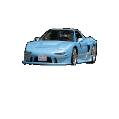

### <div>
  <div align="center" >
  
  
</div>
<div style="width: 100%;">
  
</div>
<div align="center">

</div>
<div align="center">

</div>
<div align="center">
to my personal GitHub profile!
</div>
<div align="center">

</div>
</div>

<hr>
<p align="center">

<div width="50px" align="center">

</div>
<!-- <div width="50px" >
  
- 👋 Hi, I’m [Yash Kumar](https://www.linkedin.com/in/yasholo), aka Yasholo :)
  a Software Engineer from [🇮🇳 ](https://en.wikipedia.org/wiki/India)&nbsp; I hold a Bachelor's degree in
  Computer Science and am currently studying to become effecient in DevOps 🎯
- 🔭 I have experience with several programming languages, including Bash, Python, C, CPP, JavaScript, HTML5,
  CSS3. I’m particularly interested in DevOps, and I’m currently working on a project that involves fundamental
  DevOps.
- 🌱 I'm currently learning: **Big Data | Automation | Advanced SQL | Advanced Java / Python | AWS Cloud**
- 💬 Ask me about: **Science & Technology | Technical Content Writing | Music | Reading | History**
- 👀 After graduation, I hope to work as a software engineer at a tech company, where I can continue to develop
  my skills and contribute to innovative projects. In my free time, I enjoy attending hackathons and learning
  about new technologies in the field.
- 📫 How to reach me >>> Instagram: @Yasholox , linkedin: www.linkedin.com/in/yasholo , email: yashk5635@gmail.com
</div> -->

<hr>

 &nbsp;Hi, I’m [Yash Kumar](https://www.linkedin.com/in/yasholo), aka Yasholo :) a Software Engineer from [🇮🇳 ](https://en.wikipedia.org/wiki/India)&nbsp; <br> 
&nbsp;&nbsp;&nbsp;I hold a Bachelor's degree in Computer Science and am currently studying to become <br>&nbsp;&nbsp;&nbsp;&nbsp;&nbsp;&nbsp;&nbsp;&nbsp;effecient in DevOps 🎯 <br>
&nbsp;&nbsp;I have experience with several programming languages, including <br>&nbsp;&nbsp;&nbsp;&nbsp;&nbsp;&nbsp;&nbsp;&nbsp;**Bash, Python, C, CPP, JavaScript, HTML5, CSS3**.<br> 
&nbsp;&nbsp;I’m particularly interested in DevOps, and I’m currently learning: <br>&nbsp;&nbsp;&nbsp;&nbsp;&nbsp;&nbsp;&nbsp;&nbsp;**Big Data | Automation | Advanced SQL | Advanced Java / Python | AWS Cloud** <br>&nbsp;&nbsp;&nbsp;&nbsp;&nbsp;&nbsp;&nbsp;&nbsp;and working on a project that involves fundamental **DevOps**.<br>
&nbsp;&nbsp;Ask me about: **Tech | Linux | Fitness | Literature | Cars ** <br>
&nbsp;&nbsp;Hobbies: **GYM, RUNNING, BADMINTON, READING, WRITING, CHESS, MUSIC, Many more...**.<br> 
&nbsp;&nbsp;If you want to reach out to me about anything, be it some doubt or just to hangout <br>&nbsp;&nbsp;&nbsp;&nbsp;&nbsp;&nbsp;&nbsp;&nbsp;and talk or want to game together just ping me 😉.
<br>&nbsp;&nbsp;&nbsp;&nbsp;&nbsp;&nbsp;&nbsp;&nbsp;How to reach me >>> Instagram: @Yasholox , linkedin: www.linkedin.com/in/yasholo
<br>&nbsp;&nbsp;&nbsp;&nbsp;&nbsp;&nbsp;&nbsp;&nbsp;email: yashk5635@gmail.com <br>
&nbsp;&nbsp;&nbsp;&nbsp;Fun fact: Banging your head against a wall for one hour burns **150 calories**.<br>

<hr>


```dart
// tools_I_use organized

class About extends Me { 
  const myTools = {  
    "ProgramingLanguages" : { "Dart", "Go", "Python", "Javascript", "Java", "c++" },
    "OtherLanguages" : { "HTML", "CSS", "Bash", "Json", "Markdown" },
    "Database" : { "Firebase", "Sqlite" },
    "Editors" : { "Vscode", "Xcode", "Sublime", "Neovim" },
    "Platforms" : { "Mac", "GNU/Linux", "Windows" },
    "OtherTools" : { "Git", "Figma", "Photoshop", "Gimp", "Lightroom" }
  };
}
```
<hr>
<p align="center">
<br>
<text>Changing random stuff until your program works is 'hacky' and a 'bad coding practice'. But if you do it fast enough, it's called 'Machine Learning' and pays 4x your current salary.<br> —Steve Maine, Software Engineer</text>
</p>

<hr>

<!--💬GREETINGSTITLE / 🌐WEBSITE: https://github.com/denvercoder1/readme-typing-svg -->

<!--🖼️RICK-->
<p align="center">


<!--📏LINE-->


<!--🖼️ILOVEOPENSOURCE-->


<!--🎵SPOTIFY / 🌐WEBSITE: https://github.com/kittinan/spotify-github-profile -->
<p align="center">
<a href="https://www.youtube.com/watch?v=vdB-8eLEW8g"></a>

<!--🦜PARROTSEMOJI / 🌐WEBSITE: https://github.com/seanprashad/slackmoji/ -->
<p align="center">


<!--🖼️SVG BANNER / 🌐WEBSITE: https://github.com/Akshay090/svg-banners -->
<p align="center">


<!--🔳TERMINAL / 🌐WEBSITES: https://github.com/asciinema/asciinema & https://github.com/dstein64/gifcast -->
<p align="center">


<!--📏LINE-->
<p align="center">


<!--📰RSS / TAKE IMAGE FROM https://github.com/trinib/trinib/blob/main/images/marquee.svg TO YOUR REPO AND EDIT IT-->
<p align="center">


<!--🎨CAPSULE / 🌐WEBSITES: https://github.com/kyechan99/capsule-render -->
<p align="center">


<!--🤖ASCIIART / 🌐WEBSITES: https://asciiart.website/ & https://github.com/github/markup/issues/1440#issuecomment-803889380 -->

<div align="center">
  
```diff
+@ @ @ @ @ @ @ @ @ @ @ @ @ @ @ @ @ @ @ @ @ @ @ @ @ @ @ @+
@@       o o                                           @@
@@       | |                                           @@
@@      _L_L_                                          @@
@@   ❮\/__-__\/❯ Programming isn't about what you know @@
@@   ❮(|~o.o~|)❯  It's about what you can figure out   @@
@@   ❮/ \`-'/ \❯                                       @@
@@     _/`U'\_                                         @@
@@    ( .   . )     .----------------------------.     @@
@@   / /     \ \    | while( ! (succed=try() ) ) |     @@
@@   \ |  ,  | /    '----------------------------'     @@
@@    \|=====|/                                        @@
@@     |_.^._|                                         @@
@@     | |"| |                                         @@
@@     ( ) ( )   Testing leads to failure              @@
@@     |_| |_|   and failure leads to understanding    @@
@@ _.-' _j L_ '-._                                     @@
@@(___.'     '.___)                                    @@
+@ @ @ @ @ @ @ @ @ @ @ @ @ @ @ @ @ @ @ @ @ @ @ @ @ @ @ @+
```
  
</div>
  
<!--🎨CAPSULE / 🌐WEBSITES: https://github.com/kyechan99/capsule-render -->
<p align="center">


<!--💬🃏FUNFACT / 🌐https://github.com/siddharth2016/quote-readme#update-your-readme -->
<p align="center">

<b>FUN FACT EVERYDAY🤔 :</b>
<!--STARTS_HERE_QUOTE_README-->
<i>❝An average person normally blinks 20 times a minute, but when using a computer he/she blinks only 7 times a minute.❞</i>
<!--ENDS_HERE_QUOTE_README-->

<!--📰RSS / TAKE IMAGE FROM https://github.com/trinib/trinib/blob/main/images/marquee.svg TO YOUR REPO AND EDIT IT-->
<p align="center">


<!--📏LINE-->


<!--🐍💬SNAKETITLE / 🌐WEBSITE: https://textanim.com/ -->
<p align="center">


<!--🐍📈SNAKEGRAPH / 🌐WEBSITE: https://github.com/Platane/snk & https://github.com/ironmaniiith/Github-profile-name-writer -->


<!--📉METRICS / 🌐WEBSITE: https://github.com/lowlighter/metrics -->
<h4 align="right">
<details><summary><b>𝓟&nbsp;𝓡&nbsp;𝓞&nbsp;𝓕&nbsp;𝓘&nbsp;𝓛&nbsp;𝓔&nbsp;&nbsp; 𝓜&nbsp;𝓔&nbsp;𝓣&nbsp;𝓡&nbsp;𝓘&nbsp;𝓒&nbsp;𝓢</b></summary>
<p>
<p align="center">

</p>
</details>

<!--📏LINE-->


<!--😂💬JOKETITLE / 🌐WEBSITE: https://textanim.com/ -->
<p align="center">


<!--🤣JOYEMOJI / 🌐WEBSITE: https://github.com/seanprashad/slackmoji/ -->
<p align="center">


<!--😂🃏JOKECARD / 🌐WEBSITE: https://github.com/ABSphreak/readme-jokes -->
<p align="center">


<!--💬QUOTESTITLE / 🌐WEBSITE: https://textanim.com/ -->
<p align="center">


<!--🍷WINEEMOJI / 🌐WEBSITE: https://github.com/seanprashad/slackmoji/ -->
<p align="center">


<!--💬🃏QUOTESCARD / 🌐WEBSITE: https://github.com/PiyushSuthar/github-readme-quotes#Demo & https://github.com/cheehwatang/github-readme-daily-quotes & https://github.com/shravan20/github-readme-quotes -->
<p align="center">

<p align="center">
<br><br>

<!--💬🃏MEMESTITLE / 🌐WEBSITE: https://textanim.com/ -->
<p align="center">


<!--😻CATEMOJI / 🌐WEBSITE: https://github.com/seanprashad/slackmoji/ -->
<p align="center">


<!--🃏MEMEPHOTOS / 🌐WEBSITE: https://github.com/trinib/random-memer -->
<p align="center">


<!--📏LINE-->


<!--💬FUNTITLE / 🌐WEBSITE: https://textanim.com/ -->
<p align="center">


<!--♟️CHESS / 🌐WEBSITE: https://github.com/marcizhu/readme-chess --> 
 <h4 align="center">
<table>
  <tr>
  </tr>
  <tr>
    <td><h5 align="center"><details>
  <summary><h2>&nbsp;Chess Tournament&nbsp;</h2></summary><p>

<h4 align="left">

ANYONE can take a turn on the board  
<i>Make your move !!. It's <!-- BEGIN TURN -->white(clear)<!-- END TURN --> to play(instructions beneath)</i>

<!-- BEGIN CHESS BOARD -->
|   | A | B | C | D | E | F | G | H |   |
|---|:-:|:-:|:-:|:-:|:-:|:-:|:-:|:-:|:-:|
| **8** |  |  |  |  |  |  |  |  | **8** |
| **7** |  |  |  |  |  |  |  |  | **7** |
| **6** |  |  |  |  |  |  |  |  | **6** |
| **5** |  |  |  |  |  |  |  |  | **5** |
| **4** |  |  |  |  |  |  |  |  | **4** |
| **3** |  |  |  |  |  |  |  |  | **3** |
| **2** |  |  |  |  |  |  |  |  | **2** |
| **1** |  |  |  |  |  |  |  |  | **1** |
|   | **A** | **B** | **C** | **D** | **E** | **F** | **G** | **H** |   |
<!-- END CHESS BOARD -->

To move a piece to a postion
 
**_Choose one from the following table_** :
<!-- BEGIN MOVES LIST -->
|  FROM  | TO (Just click a link!) |
| :----: | :---------------------- |
| **A1** | [B1](https://github.com/trinib/trinib/issues/new?body=Please+do+not+change+the+title.+Just+click+%22Submit+new+issue%22.+You+don%27t+need+to+do+anything+else+%3AD&title=Chess%3A+Move+A1+to+B1), [C1](https://github.com/trinib/trinib/issues/new?body=Please+do+not+change+the+title.+Just+click+%22Submit+new+issue%22.+You+don%27t+need+to+do+anything+else+%3AD&title=Chess%3A+Move+A1+to+C1) |
| **A2** | [A3](https://github.com/trinib/trinib/issues/new?body=Please+do+not+change+the+title.+Just+click+%22Submit+new+issue%22.+You+don%27t+need+to+do+anything+else+%3AD&title=Chess%3A+Move+A2+to+A3), [A4](https://github.com/trinib/trinib/issues/new?body=Please+do+not+change+the+title.+Just+click+%22Submit+new+issue%22.+You+don%27t+need+to+do+anything+else+%3AD&title=Chess%3A+Move+A2+to+A4) |
| **B2** | [B3](https://github.com/trinib/trinib/issues/new?body=Please+do+not+change+the+title.+Just+click+%22Submit+new+issue%22.+You+don%27t+need+to+do+anything+else+%3AD&title=Chess%3A+Move+B2+to+B3), [B4](https://github.com/trinib/trinib/issues/new?body=Please+do+not+change+the+title.+Just+click+%22Submit+new+issue%22.+You+don%27t+need+to+do+anything+else+%3AD&title=Chess%3A+Move+B2+to+B4) |
| **C3** | [A4](https://github.com/trinib/trinib/issues/new?body=Please+do+not+change+the+title.+Just+click+%22Submit+new+issue%22.+You+don%27t+need+to+do+anything+else+%3AD&title=Chess%3A+Move+C3+to+A4), [B1](https://github.com/trinib/trinib/issues/new?body=Please+do+not+change+the+title.+Just+click+%22Submit+new+issue%22.+You+don%27t+need+to+do+anything+else+%3AD&title=Chess%3A+Move+C3+to+B1), [B5](https://github.com/trinib/trinib/issues/new?body=Please+do+not+change+the+title.+Just+click+%22Submit+new+issue%22.+You+don%27t+need+to+do+anything+else+%3AD&title=Chess%3A+Move+C3+to+B5), [D5](https://github.com/trinib/trinib/issues/new?body=Please+do+not+change+the+title.+Just+click+%22Submit+new+issue%22.+You+don%27t+need+to+do+anything+else+%3AD&title=Chess%3A+Move+C3+to+D5), [E4](https://github.com/trinib/trinib/issues/new?body=Please+do+not+change+the+title.+Just+click+%22Submit+new+issue%22.+You+don%27t+need+to+do+anything+else+%3AD&title=Chess%3A+Move+C3+to+E4) |
| **D1** | [B1](https://github.com/trinib/trinib/issues/new?body=Please+do+not+change+the+title.+Just+click+%22Submit+new+issue%22.+You+don%27t+need+to+do+anything+else+%3AD&title=Chess%3A+Move+D1+to+B1), [C1](https://github.com/trinib/trinib/issues/new?body=Please+do+not+change+the+title.+Just+click+%22Submit+new+issue%22.+You+don%27t+need+to+do+anything+else+%3AD&title=Chess%3A+Move+D1+to+C1), [D2](https://github.com/trinib/trinib/issues/new?body=Please+do+not+change+the+title.+Just+click+%22Submit+new+issue%22.+You+don%27t+need+to+do+anything+else+%3AD&title=Chess%3A+Move+D1+to+D2), [D3](https://github.com/trinib/trinib/issues/new?body=Please+do+not+change+the+title.+Just+click+%22Submit+new+issue%22.+You+don%27t+need+to+do+anything+else+%3AD&title=Chess%3A+Move+D1+to+D3), [D4](https://github.com/trinib/trinib/issues/new?body=Please+do+not+change+the+title.+Just+click+%22Submit+new+issue%22.+You+don%27t+need+to+do+anything+else+%3AD&title=Chess%3A+Move+D1+to+D4), [D5](https://github.com/trinib/trinib/issues/new?body=Please+do+not+change+the+title.+Just+click+%22Submit+new+issue%22.+You+don%27t+need+to+do+anything+else+%3AD&title=Chess%3A+Move+D1+to+D5), [D6](https://github.com/trinib/trinib/issues/new?body=Please+do+not+change+the+title.+Just+click+%22Submit+new+issue%22.+You+don%27t+need+to+do+anything+else+%3AD&title=Chess%3A+Move+D1+to+D6), [D7](https://github.com/trinib/trinib/issues/new?body=Please+do+not+change+the+title.+Just+click+%22Submit+new+issue%22.+You+don%27t+need+to+do+anything+else+%3AD&title=Chess%3A+Move+D1+to+D7) |
| **E1** | [D2](https://github.com/trinib/trinib/issues/new?body=Please+do+not+change+the+title.+Just+click+%22Submit+new+issue%22.+You+don%27t+need+to+do+anything+else+%3AD&title=Chess%3A+Move+E1+to+D2) |
| **E2** | [E3](https://github.com/trinib/trinib/issues/new?body=Please+do+not+change+the+title.+Just+click+%22Submit+new+issue%22.+You+don%27t+need+to+do+anything+else+%3AD&title=Chess%3A+Move+E2+to+E3), [E4](https://github.com/trinib/trinib/issues/new?body=Please+do+not+change+the+title.+Just+click+%22Submit+new+issue%22.+You+don%27t+need+to+do+anything+else+%3AD&title=Chess%3A+Move+E2+to+E4) |
| **F3** | [D2](https://github.com/trinib/trinib/issues/new?body=Please+do+not+change+the+title.+Just+click+%22Submit+new+issue%22.+You+don%27t+need+to+do+anything+else+%3AD&title=Chess%3A+Move+F3+to+D2), [D4](https://github.com/trinib/trinib/issues/new?body=Please+do+not+change+the+title.+Just+click+%22Submit+new+issue%22.+You+don%27t+need+to+do+anything+else+%3AD&title=Chess%3A+Move+F3+to+D4), [E5](https://github.com/trinib/trinib/issues/new?body=Please+do+not+change+the+title.+Just+click+%22Submit+new+issue%22.+You+don%27t+need+to+do+anything+else+%3AD&title=Chess%3A+Move+F3+to+E5), [G1](https://github.com/trinib/trinib/issues/new?body=Please+do+not+change+the+title.+Just+click+%22Submit+new+issue%22.+You+don%27t+need+to+do+anything+else+%3AD&title=Chess%3A+Move+F3+to+G1), [H4](https://github.com/trinib/trinib/issues/new?body=Please+do+not+change+the+title.+Just+click+%22Submit+new+issue%22.+You+don%27t+need+to+do+anything+else+%3AD&title=Chess%3A+Move+F3+to+H4) |
| **G2** | [G3](https://github.com/trinib/trinib/issues/new?body=Please+do+not+change+the+title.+Just+click+%22Submit+new+issue%22.+You+don%27t+need+to+do+anything+else+%3AD&title=Chess%3A+Move+G2+to+G3), [G4](https://github.com/trinib/trinib/issues/new?body=Please+do+not+change+the+title.+Just+click+%22Submit+new+issue%22.+You+don%27t+need+to+do+anything+else+%3AD&title=Chess%3A+Move+G2+to+G4) |
| **G5** | [C1](https://github.com/trinib/trinib/issues/new?body=Please+do+not+change+the+title.+Just+click+%22Submit+new+issue%22.+You+don%27t+need+to+do+anything+else+%3AD&title=Chess%3A+Move+G5+to+C1), [D2](https://github.com/trinib/trinib/issues/new?body=Please+do+not+change+the+title.+Just+click+%22Submit+new+issue%22.+You+don%27t+need+to+do+anything+else+%3AD&title=Chess%3A+Move+G5+to+D2), [E3](https://github.com/trinib/trinib/issues/new?body=Please+do+not+change+the+title.+Just+click+%22Submit+new+issue%22.+You+don%27t+need+to+do+anything+else+%3AD&title=Chess%3A+Move+G5+to+E3), [F4](https://github.com/trinib/trinib/issues/new?body=Please+do+not+change+the+title.+Just+click+%22Submit+new+issue%22.+You+don%27t+need+to+do+anything+else+%3AD&title=Chess%3A+Move+G5+to+F4), [F6](https://github.com/trinib/trinib/issues/new?body=Please+do+not+change+the+title.+Just+click+%22Submit+new+issue%22.+You+don%27t+need+to+do+anything+else+%3AD&title=Chess%3A+Move+G5+to+F6), [H4](https://github.com/trinib/trinib/issues/new?body=Please+do+not+change+the+title.+Just+click+%22Submit+new+issue%22.+You+don%27t+need+to+do+anything+else+%3AD&title=Chess%3A+Move+G5+to+H4), [H6](https://github.com/trinib/trinib/issues/new?body=Please+do+not+change+the+title.+Just+click+%22Submit+new+issue%22.+You+don%27t+need+to+do+anything+else+%3AD&title=Chess%3A+Move+G5+to+H6) |
| **H1** | [G1](https://github.com/trinib/trinib/issues/new?body=Please+do+not+change+the+title.+Just+click+%22Submit+new+issue%22.+You+don%27t+need+to+do+anything+else+%3AD&title=Chess%3A+Move+H1+to+G1) |
| **H2** | [H3](https://github.com/trinib/trinib/issues/new?body=Please+do+not+change+the+title.+Just+click+%22Submit+new+issue%22.+You+don%27t+need+to+do+anything+else+%3AD&title=Chess%3A+Move+H2+to+H3), [H4](https://github.com/trinib/trinib/issues/new?body=Please+do+not+change+the+title.+Just+click+%22Submit+new+issue%22.+You+don%27t+need+to+do+anything+else+%3AD&title=Chess%3A+Move+H2+to+H4) |
<!-- END MOVES LIST -->

Having fun? Ask a friend to play next move to get the next turn !

<details>
  <summary>How it works</summary>
When you click on a link it will submit a new issue with the desired move, create the issue and a GitHub action is triggered, which in turn runs a small python script that performs the specified movement, updates this README file and commits the changes.
</details>


<details>
  <summary>Last 5 moves in this game</summary>
<!-- BEGIN LAST MOVES -->

| Move | Author |
| :--: | :----- |
| `F7` to `F6` | [ @Nauseouswave](https://github.com/Nauseouswave) |
| `C1` to `G5` | [ @marcelo-schreiber](https://github.com/marcelo-schreiber) |
| `B7` to `C6` | [ @lulunac27a](https://github.com/lulunac27a) |
| `D5` to `C6` | [ @trinib](https://github.com/trinib) |
| `G6` to `G5` | [ @Denchyaknow](https://github.com/Denchyaknow) |

<!-- END LAST MOVES -->
</details>

<details>
  <summary>Top 10 most moves across all games</summary>
<!-- BEGIN TOP MOVES -->

| Total moves |  User  |
| :---------: | :----- |
| 26 | [@trinib](https://github.com/trinib) |
| 14 | [@JayantGoel001](https://github.com/JayantGoel001) |
| 8 | [@viktoriussuwandi](https://github.com/viktoriussuwandi) |
| 5 | [@lulunac27a](https://github.com/lulunac27a) |
| 3 | [@Sabyasachi-Seal](https://github.com/Sabyasachi-Seal) |
| 2 | [@Basvdlouw](https://github.com/Basvdlouw) |
| 2 | [@TomfromBerlin](https://github.com/TomfromBerlin) |
| 2 | [@SagXD](https://github.com/SagXD) |
| 2 | [@apluquet](https://github.com/apluquet) |
| 2 | [@MeBadDev](https://github.com/MeBadDev) |

<!-- END TOP MOVES -->

</details>
</details><h5 align="center">
  </tr>
 </table>
      
<!--CONNECTDOT🔴🟡 / 🌐WEBSITE: https://github.com/bloedboemmel/bloedboemmel --> 
 <h4 align="center">
<table>
  <tr>
  </tr>
  <tr>
    <td><h5 align="center"><details>
  <summary><h2>&nbsp;&nbsp;&nbsp;Connect 4 Dots&nbsp;&nbsp;&nbsp;</h2></summary><p>

<h4 align="left">

Here you can play Connect4. Just click a number under the grid to move. It's <!-- BEGIN TURN2 -->yellow<!-- END TURN2 --> turn.

<!-- BEGIN CONNECT4 BOARD -->
|   | 1 | 2 | 3 | 4 | 5 | 6 | 7 |   |
|---|:-:|:-:|:-:|:-:|:-:|:-:|:-:|:-:|
|---| |  |  |  |  |  |  | |---|
|---| |  |  |  |  |  |  | |---|
|---| |  |  |  |  |  |  | |---|
|---| |  |  |  |  |  |  | |---|
|---| |  |  |  |  |  |  | |---|
|---| |  |  |  |  |  |  | |---|
|   | [1](https://github.com/trinib/trinib/issues/new?body=Please+do+not+change+the+title.+Just+click+%22Submit+new+issue%22.+You+don%27t+need+to+do+anything+else+%3AD&title=Connect4%3A+Put+1) | [2](https://github.com/trinib/trinib/issues/new?body=Please+do+not+change+the+title.+Just+click+%22Submit+new+issue%22.+You+don%27t+need+to+do+anything+else+%3AD&title=Connect4%3A+Put+2) | [3](https://github.com/trinib/trinib/issues/new?body=Please+do+not+change+the+title.+Just+click+%22Submit+new+issue%22.+You+don%27t+need+to+do+anything+else+%3AD&title=Connect4%3A+Put+3) | [4](https://github.com/trinib/trinib/issues/new?body=Please+do+not+change+the+title.+Just+click+%22Submit+new+issue%22.+You+don%27t+need+to+do+anything+else+%3AD&title=Connect4%3A+Put+4) | [5](https://github.com/trinib/trinib/issues/new?body=Please+do+not+change+the+title.+Just+click+%22Submit+new+issue%22.+You+don%27t+need+to+do+anything+else+%3AD&title=Connect4%3A+Put+5) | [6](https://github.com/trinib/trinib/issues/new?body=Please+do+not+change+the+title.+Just+click+%22Submit+new+issue%22.+You+don%27t+need+to+do+anything+else+%3AD&title=Connect4%3A+Put+6) | [7](https://github.com/trinib/trinib/issues/new?body=Please+do+not+change+the+title.+Just+click+%22Submit+new+issue%22.+You+don%27t+need+to+do+anything+else+%3AD&title=Connect4%3A+Put+7) |   |
<!-- END CONNECT4 BOARD -->
<!-- BEGIN MOVES LIST2 -->
<!-- END MOVES LIST2 -->

<details>
  <summary>Last 5 moves in this game</summary>
<!-- BEGIN LAST MOVES2 -->

| Move | Author |
| :--: | :----- |
| `5` |  [ @BrunnerLivio](https://github.com/BrunnerLivio) | |
| `5` |  [ @RutsuKun](https://github.com/RutsuKun) | |
| `3` |  [ @lulunac27a](https://github.com/lulunac27a) | |
| `5` |  [ @vitheshshetty00](https://github.com/vitheshshetty00) | |
| `2` |  [ @TAKE72K](https://github.com/TAKE72K) | |

<!-- END LAST MOVES2 -->
</details>

<details>
  <summary>Top 10 most moves across all games</summary>
<!-- BEGIN TOP MOVES2 -->

| Total moves |  User  |
| :---------: | :----- |
| 12 |  [@trinib](https://github.com/trinib) | |
| 9 |  [@viktoriussuwandi](https://github.com/viktoriussuwandi) | |
| 6 |  [@lulunac27a](https://github.com/lulunac27a) | |
| 5 |  [@oxoovo](https://github.com/oxoovo) | |
| 4 |  [@benzlokzik](https://github.com/benzlokzik) | |
| 3 |  [@jhoitenga](https://github.com/jhoitenga) | |
| 2 |  [@JayantGoel001](https://github.com/JayantGoel001) | |
| 2 |  [@mauro-balades](https://github.com/mauro-balades) | |
| 2 |  [@Cophhy](https://github.com/Cophhy) | |
| 2 |  [@TomfromBerlin](https://github.com/TomfromBerlin) | |

<!-- END TOP MOVES2 -->
</details>
</details>
</details><h5 align="center">
  </tr>
 </table>
      
#
<!--✏️WORDBOARD / 🌐WEBSITE: https://github.com/JessicaLim8/JessicaLim8 --> 
<h2 align="center">
Join the Word Cloud Board :cloud: :pencil2:

### :thought_balloon: <a href="https://github.com/trinib/word-cloud/issues/new?template=addword.md&title=wordcloud%7Cadd%7C%3CINSERT-WORD%3E"><b>Add your name</b></a> to see the word cloud update in real time :rocket:

:star2: Don't like the arrangement? <a href="https://github.com/trinib/word-cloud/issues/new?template=shufflecloud.md&title=wordcloud%7Cshuffle"><b>Regenerate it</b></a> :game_die:

<h3 align="center">
📛Github Usernames📛 
</br> 


<!--📏LINE-->

<p align="center">

<!--🐱CAT-->
<p align="center">


<!--🤔INTERESTTITLE-->
<p align="center">


<!--🖼️🖼️INTERSTLOGOS-->
<p align="center">


</h4>

<!--🖼️⭐🔱STARRED/FORK-->
<h4 align="right">
 
<table>
  <tr>
   
   &nbsp;&nbsp;&nbsp;&nbsp;&nbsp;&nbsp;&nbsp;&nbsp;&nbsp;&nbsp;&nbsp;&nbsp;&nbsp;&nbsp;&nbsp;&nbsp;&nbsp;&nbsp;&nbsp;
   &nbsp;&nbsp;&nbsp;&nbsp;&nbsp;&nbsp;&nbsp;&nbsp;&nbsp;&nbsp;&nbsp;&nbsp;&nbsp;&nbsp;
  </tr>
  <tr>
    <td><p align="center"><a href="https://github.com/trinib?tab=stars"><b>MY STARRED REPOS <br>AND TOPICS</b></a>
    <td><p align="center"><a href="https://github.com/trinib/trinib/edit/main/README.md"><b>FORK PROFILE WITH <br>EASY EDITING</b></a>
  </tr>
 </table>
 
<!--📏LINE-->
<p align="center">


<!--🎨THEMEMODE / 🌐WEBSITE: https://fancytext.blogspot.com/ -->
<h4 align="left">
</h4>
 
╔═&nbsp;&nbsp;👀 𝕐&nbsp;𝕆&nbsp;𝕌&nbsp;ℝ&nbsp;&nbsp;𝕋&nbsp;ℍ&nbsp;𝔼&nbsp;𝕄&nbsp;𝔼&nbsp;&nbsp;𝕄&nbsp;𝕆&nbsp;𝔻&nbsp;𝔼 👀
<h4>
<h4 align="left">  
 
╚═════ &nbsp;𝐈𝐓'𝐒 [𝐃𝐀𝐑𝐊⚫](https://github.com/settings/appearance#gh-dark-mode-only)[𝐁𝐑𝐈𝐆𝐇𝐓⚪](https://github.com/settings/appearance#gh-light-mode-only) 𝐈𝐍 𝐇𝐄𝐑𝐄...
<h4>

<!--🪳ROACH&🕷️SPIDER--> 
<p align="left">
&nbsp;&nbsp;&nbsp;&nbsp;&nbsp;&nbsp;&nbsp;&nbsp;&nbsp;&nbsp;&nbsp;&nbsp;&nbsp;&nbsp;&nbsp;&nbsp;&nbsp;&nbsp;&nbsp;&nbsp;&nbsp;&nbsp;&nbsp;&nbsp;&nbsp;&nbsp;&nbsp;&nbsp;&nbsp;&nbsp;&nbsp;&nbsp;&nbsp;&nbsp;&nbsp;&nbsp;&nbsp;&nbsp;&nbsp;&nbsp;&nbsp;&nbsp;&nbsp;&nbsp;&nbsp;&nbsp;&nbsp;&nbsp;&nbsp;&nbsp;&nbsp;&nbsp;&nbsp;&nbsp;&nbsp;&nbsp;&nbsp;&nbsp;&nbsp;&nbsp;&nbsp;&nbsp;&nbsp;&nbsp;&nbsp;&nbsp;&nbsp;&nbsp;&nbsp;&nbsp;&nbsp;&nbsp;&nbsp;&nbsp;&nbsp;&nbsp;&nbsp;&nbsp;&nbsp;&nbsp;&nbsp;&nbsp;&nbsp;&nbsp;&nbsp;&nbsp;&nbsp;&nbsp;&nbsp;&nbsp;&nbsp;&nbsp;&nbsp;&nbsp;&nbsp;&nbsp;&nbsp;&nbsp;&nbsp;&nbsp;&nbsp;&nbsp;&nbsp;&nbsp;&nbsp;&nbsp;&nbsp;&nbsp;&nbsp;&nbsp;&nbsp;&nbsp;
 
<!--🦶FOOTER--> 


<!--⚽️ACTIVITY / 🌐WEBSITE: https://github.com/Readme-Workflows/recent-activity -->
<!--RECENT_ACTIVITY:start-->
<!--RECENT_ACTIVITY:end-->
<p align="right">
<!--RECENT_ACTIVITY:last_update-->
<i>Last refresh</i> : <b>Tuesday, February 6th, 2024, 4:53:38 AM</b>
<!--RECENT_ACTIVITY:last_update_end-->

<!--🤝CONTRIBUTOR IMAGE / 🌐WEBSITE: https://github.com/lacolaco/contributors-img --> 
<br><p align="center">
<a href="https://github.com/trinib/trinib/graphs/contributors">
  
</a>

<!-- 

𝐈𝐅 𝐘𝐎𝐔 𝐑𝐄𝐀𝐂𝐇𝐄𝐃 𝐇𝐄𝐑𝐄 (C O N G R A T S 🎉🎈🎊) 

𝐂𝐇𝐄𝐂𝐊 𝐎𝐔𝐓 𝐓𝐇𝐄𝐒𝐄:


██████╗ ███████╗ █████╗ ██╗   ██╗████████╗██╗███████╗██╗   ██╗     ██████╗ ██╗████████╗██╗  ██╗██╗   ██╗██████╗ 
██╔══██╗██╔════╝██╔══██╗██║   ██║╚══██╔══╝██║██╔════╝╚██╗ ██╔╝    ██╔════╝ ██║╚══██╔══╝██║  ██║██║   ██║██╔══██╗
██████╔╝█████╗  ███████║██║   ██║   ██║   ██║█████╗   ╚████╔╝     ██║  ███╗██║   ██║   ███████║██║   ██║██████╔╝
██╔══██╗██╔══╝  ██╔══██║██║   ██║   ██║   ██║██╔══╝    ╚██╔╝      ██║   ██║██║   ██║   ██╔══██║██║   ██║██╔══██╗
██████╔╝███████╗██║  ██║╚██████╔╝   ██║   ██║██║        ██║       ╚██████╔╝██║   ██║   ██║  ██║╚██████╔╝██████╔╝
╚═════╝ ╚══════╝╚═╝  ╚═╝ ╚═════╝    ╚═╝   ╚═╝╚═╝        ╚═╝        ╚═════╝ ╚═╝   ╚═╝   ╚═╝  ╚═╝ ╚═════╝ ╚═════╝                                         
https://github.com/rzashakeri/beautify-github-profile


 ██████╗ ██╗████████╗██╗  ██╗██╗   ██╗██████╗     ███████╗███████╗ █████╗ ██████╗  ██████╗██╗  ██╗
██╔════╝ ██║╚══██╔══╝██║  ██║██║   ██║██╔══██╗    ██╔════╝██╔════╝██╔══██╗██╔══██╗██╔════╝██║  ██║
██║  ███╗██║   ██║   ███████║██║   ██║██████╔╝    ███████╗█████╗  ███████║██████╔╝██║     ███████║
██║   ██║██║   ██║   ██╔══██║██║   ██║██╔══██╗    ╚════██║██╔══╝  ██╔══██║██╔══██╗██║     ██╔══██║
╚██████╔╝██║   ██║   ██║  ██║╚██████╔╝██████╔╝    ███████║███████╗██║  ██║██║  ██║╚██████╗██║  ██║
 ╚═════╝ ╚═╝   ╚═╝   ╚═╝  ╚═╝ ╚═════╝ ╚═════╝     ╚══════╝╚══════╝╚═╝  ╚═╝╚═╝  ╚═╝ ╚═════╝╚═╝  ╚═╝
https://github.com/gennaro-tedesco/gh-s


███████╗██╗   ██╗███╗   ██╗ ██████╗    ███████╗ ██████╗ ██████╗ ██╗  ██╗███████╗
██╔════╝╚██╗ ██╔╝████╗  ██║██╔════╝    ██╔════╝██╔═══██╗██╔══██╗██║ ██╔╝██╔════╝
███████╗ ╚████╔╝ ██╔██╗ ██║██║         █████╗  ██║   ██║██████╔╝█████╔╝ ███████╗
╚════██║  ╚██╔╝  ██║╚██╗██║██║         ██╔══╝  ██║   ██║██╔══██╗██╔═██╗ ╚════██║
███████║   ██║   ██║ ╚████║╚██████╗    ██║     ╚██████╔╝██║  ██║██║  ██╗███████║
╚══════╝   ╚═╝   ╚═╝  ╚═══╝ ╚═════╝    ╚═╝      ╚═════╝ ╚═╝  ╚═╝╚═╝  ╚═╝╚══════╝
https://github.com/wei/pull

██████╗ ███████╗███████╗██╗███╗   ██╗███████╗██████╗        ██████╗ ██╗████████╗██╗  ██╗██╗   ██╗██████╗ 
██╔══██╗██╔════╝██╔════╝██║████╗  ██║██╔════╝██╔══██╗      ██╔════╝ ██║╚══██╔══╝██║  ██║██║   ██║██╔══██╗
██████╔╝█████╗  █████╗  ██║██╔██╗ ██║█████╗  ██║  ██║█████╗██║  ███╗██║   ██║   ███████║██║   ██║██████╔╝
██╔══██╗██╔══╝  ██╔══╝  ██║██║╚██╗██║██╔══╝  ██║  ██║╚════╝██║   ██║██║   ██║   ██╔══██║██║   ██║██╔══██╗
██║  ██║███████╗██║     ██║██║ ╚████║███████╗██████╔╝      ╚██████╔╝██║   ██║   ██║  ██║╚██████╔╝██████╔╝
╚═╝  ╚═╝╚══════╝╚═╝     ╚═╝╚═╝  ╚═══╝╚══════╝╚═════╝        ╚═════╝ ╚═╝   ╚═╝   ╚═╝  ╚═╝ ╚═════╝ ╚═════╝ 
https://github.com/refined-github/refined-github

-->                                                                                                        

<!--
**trinib/trinib** is a ✨ _special_ ✨ repository because its `README.md` (this file) appears on your GitHub profile.

Here are some ideas to get you started:

- 🔭 I’m currently working on ...
- 🌱 I’m currently learning ...
- 👯 I’m looking to collaborate on ...
- 🤔 I’m looking for help with ...
- 💬 Ask me about ...
- 📫 How to reach me: ...
- 😄 Pronouns: ...
- ⚡ Fun fact: ...
-->

<hr>

---

| 🎵 Now Playing                                                                                                                    |
| ------------------------------------------------------------------------------------------------------------------------------ |
| <a href="https://status.nmoo.dev/now-playing?open"></a> |


<table>
  <thead>
    <tr>
      <th>📈 Top Tracks</th>
    </tr>
  </thead>
  <tbody>
    <tr>
      <td><a href="https://status.nmoo.dev/top-tracks?i=1&open"></a></td>
    </tr>
    <tr></tr> <!-- hide gray row -->
    <tr>
      <td><a href="https://status.nmoo.dev/top-tracks?i=2&open"></a></td>
    </tr>
    <tr></tr> <!-- hide gray row -->
    <tr>
      <td><a href="https://status.nmoo.dev/top-tracks?i=3&open"></a></td>
    </tr>
  </tbody>
</table>

<hr>

<!---
Yasholo/Yasholo is a ✨ special ✨ repository because its `README.md` (this file) appears on your GitHub profile.
You can click the Preview link to take a look at your changes.
--->
